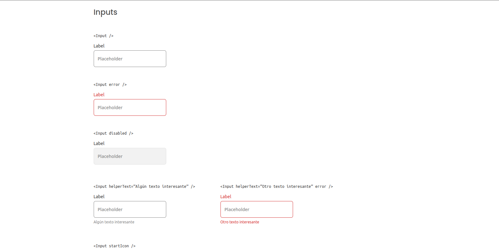
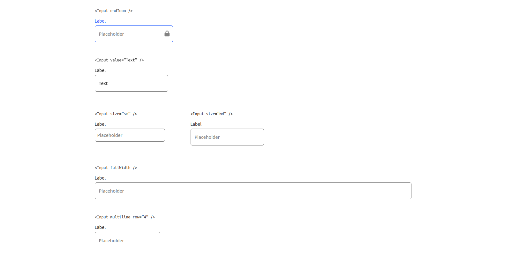
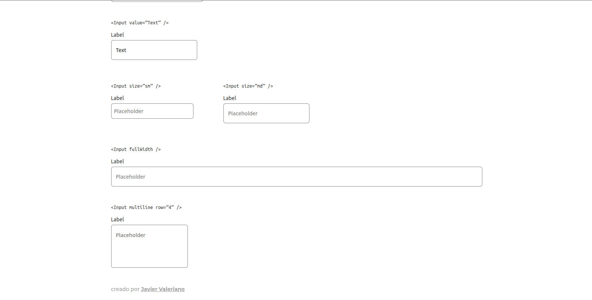
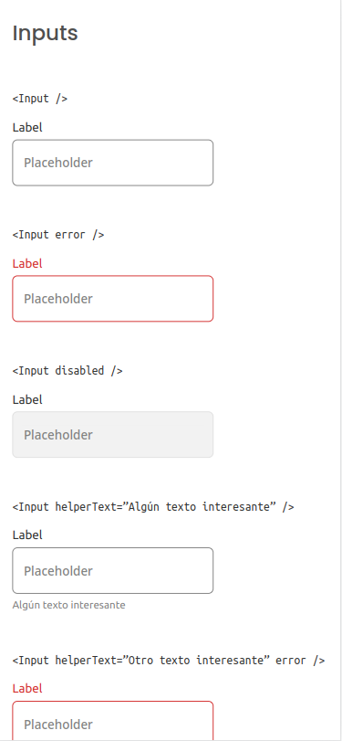
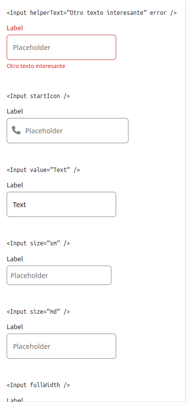
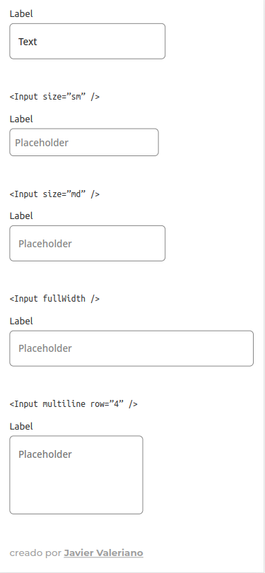

<h1 align="center">Componente Input | Input Component</h1>

<div align="center">
   Solution for a challenge from  <a href="http://devchallenges.io" target="_blank">Devchallenges.io</a>.
</div>

<div align="center">
  <h3>
    <a href="https://javiervaleriano.github.io/reusable-input-component">
      Demo
    </a>
    <span> | </span>
    <a href="https://{your-url-to-the-solution}">
      Solución / Solution
    </a>
    <span> | </span>
    <a href="https://devchallenges.io/challenges/TSqutYM4c5WtluM7QzGp">
      Desafío / Challenge
    </a>
  </h3>
</div>

<!-- TABLE OF CONTENTS -->

## Table of Contents

- [Visión general | Overview](#visi%C3%B3n-general--overview)
  - [Construido con | Built With](#construido-con--built-with)
- [Características | Features](#caracter%C3%ADsticas--features)
- [Cómo usar | How to use](#c%C3%B3mo-usar--how-to-use)
- [Contacto | Contact](#contacto--contact)

<!-- OVERVIEW -->

## Visión general | Overview

### Escritorio | Desktop





### Móvil | Mobile





**lang="es"**: ¡Hola, persona que está viendo mi proyecto! :) Aquí puedes ver <a href="https://javiervaleriano.github.io/reusable-input-component" target="_blank">mi demo a la solución</a>. En el proceso de desarrollo me encontré con algunas interrogantes acerca de cómo poder abordar ciertas características de las historias de usuario para reflejarlo en el código. Al final en algunas utilicé mi creatividad para poder añadirle la funcionalidad correspondiente. Lo logré y finalmente fue bastante similar al proyecto anterior que hice del <a href="https://javiervaleriano.github.io/reusable-button-component" target="_blank">componente de botón</a>.

En este proyecto he mejorado mi capacidad de escribir código React para la reutilización de componentes.

**lang="en"**: Hello, person who is viewing my project! :) Here you can see my <a href="https://javiervaleriano.github.io/reusable-input-component" target="_blank">demo to the solution</a>. In the development process I encountered some questions about how to address certain features of the user stories to reflect it in the code. In the end in some of them I used my creativity to be able to add the corresponding functionality. I succeeded and finally it was quite similar to the previous project I did of the <a href="https://javiervaleriano.github.io/reusable-button-component" target="_blank">button component</a>.

In this project I improved my ability to write React code for component reuse.

### Construido con | Built With

<!-- This section should list any major frameworks that you built your project using. Here are a few examples.-->

- [React](https://reactjs.org/)

## Características | Features

<!-- List the features of your application or follow the template. Don't share the figma file here :) -->

**lang="es"**: Esta aplicación/sitio se creó como una entrega a un desafío de [Devchallenges](https://devchallenges.io/challenges). El [desafío](https://devchallenges.io/challenges/TSqutYM4c5WtluM7QzGp) fue crear una página para completar las historias de usuario dadas:

**lang="en"**: This application/site was created as a submission to a [DevChallenges](https://devchallenges.io/challenges) challenge. The [challenge](https://devchallenges.io/challenges/TSqutYM4c5WtluM7QzGp) was to build a page to complete the given user stories.

- User story: Puedo ver el estado de error | I can see error state

- User story: Pudeo elegir desactivar el campo de entrada | I can choose to disable input

- User story: Puedo elegir tener un texto de ayuda | I can choose to have helper text

- User story: Puedo elegir tener un ícono a la izquierda o a la derecha | I can choose to have an icon on the left or right

- User story: Puedo tener diferentes tamaños de campos de entrada | I can have different input sizes

- User story: Puedo tener diferentes colores | I can have different colors

- User story: Puedo elegir que el campo de entrada tome el ancho del elemento padre | I can choose to have input take the width of the parent

- User story: Puedo tener un campo de entrada multilínea como un textarea (área de texto) | I can have multiline input like a textarea

- User story: Cuando paso por encima o enfoco, puedo ver indicadores visuales | When I hover or focus, I can see visual indicators

- User story: Aún puedo acceder a todos los atributos del campo de entrada | I can still access all input attributes.

## Cómo usar | How To Use

<!-- Example:  -->

**lang="es"**: Para clonar y ejecutar esta aplicación, necesitarás [Git](https://git-scm.com) y [Node.js](https://nodejs.org/en/download/) (que viene con [npm](https://www.npmjs.com)) instalados en tu ordenador. Desde tu línea de comandos:

```bash
# Clone this repository
$ git clone https://github.com/javiervaleriano/reusable-input-component
# Install dependencies
$ npm install
# Run the app
$ npm start
```

**lang="en"**: To clone and run this application, you'll need [Git](https://git-scm.com) and [Node.js](https://nodejs.org/en/download/) (which comes with [npm](https://www.npmjs.com)) installed on your computer. From your command line:

```bash
# Clone this repository
$ git clone https://github.com/javiervaleriano/reusable-input-component
# Install dependencies
$ npm install
# Run the app
$ npm start
```

## Contacto | Contact

- [Sitio web | Website](https://javiervaleriano.github.io/javiervaleriano-portfolio)
- Codepen: [@javiervaleriano](https://codepen.io/javiervaleriano)
- [Devchallenges.io](https://devchallenges.io/portfolio/javiervaleriano)
- GitHub: [@javiervaleriano](https://github.com/javiervaleriano)
- Twitter: [@javaleriano2](https://twitter.com/javaleriano2)
